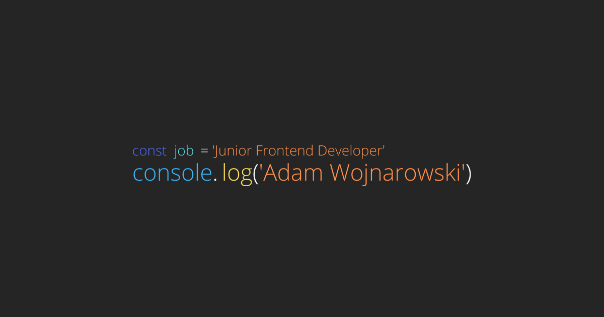

# Adam Wojnarowski - Junior Frontend Developer
> My simple portfolio website.

## Table of contents
* [General info](#general-info)
* [Screenshots](#screenshots)
* [Technologies](#technologies)
* [Setup](#setup)
* [Available scripts](#available scripts)
* [Status](#status)

## General info
It's my porfolio website. I'd like to present my skills and projects. 

## Screenshots
TODO

## Technologies
* WTF Webpack starterkit
* HTML + CSS + JS
* GitHub API
* CSS Grid

## Setup
Click on `Use this template` button to generate a new repository based on this starter kit. After that clone it to your computer, go to the project directory in console and type `npm install`.

## Available scripts

`npm run start` - runs development mode

`npm run build` - runs build process for production

`npm run publish` - runs build process and publish the page using `gh-pages` branch

## Status
Project is: _in progress_
